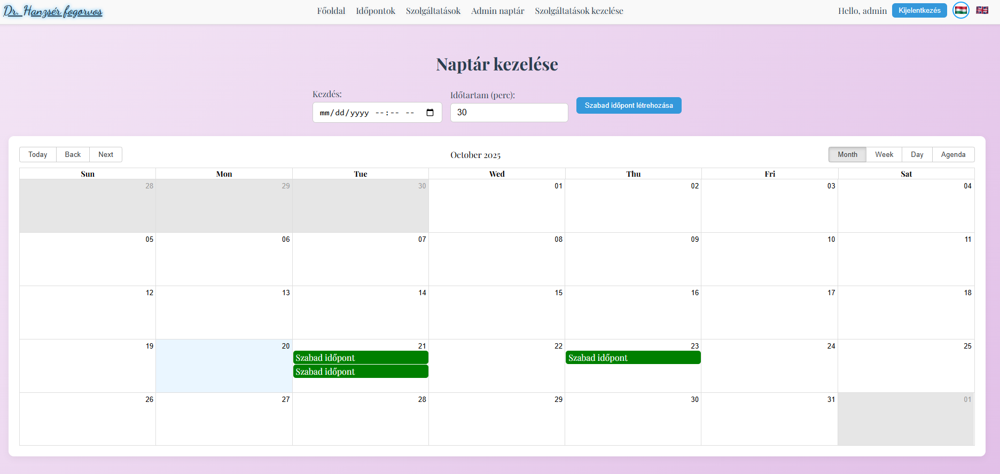
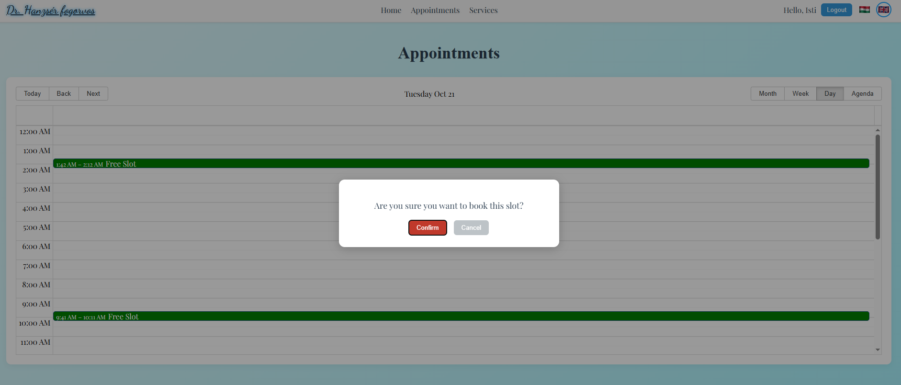
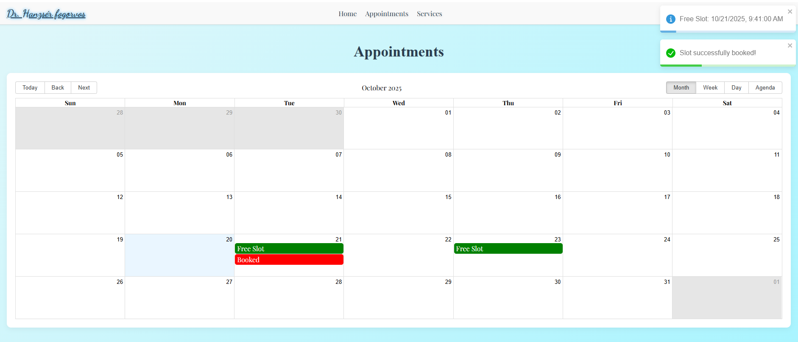

# 🧭 Appointment Booking System

## 📖 About The Project

This project is a **full-stack appointment booking system** where users can:

* Register or log in (via email/password or Google).
* Book appointments from available time slots.
* Admins can manage events and services using a protected admin dashboard.

The application demonstrates a React frontend, Node.js backend, and PostgreSQL database with authentication, translation, and Google OAuth integration.

---

## 🚀 Core Features

* 🔐 **User authentication**
* 📅 **Booking system** with calendar view
* 🧑‍💼 **Admin dashboard** for managing services and schedules
* 🌍 **Multi-language support** (Hungarian / English)
* 💬 **Real-time toast notifications**
* 📱 **Responsive design** (mobile-friendly)

---

## 🖼️ Screenshot

Admin view


User view



---

## 🛠️ Built With / Tech Stack

**Frontend:**

* React 18
* React Router DOM
* React Toastify
* CSS Modules
* Google OAuth

**Backend:**

* Node.js / Express.js
* PostgreSQL (with `pg` module)
* JWT Authentication
* Bcrypt for password hashing
* CORS, dotenv

---

## ⚙️ Prerequisites / Dependencies

* Node.js (v18 or later)
* PostgreSQL (running locally or in Docker)
* Google Cloud OAuth credentials
* `.env` file in the backend with:

  ```
  DB_USER= 
  DB_PASSWORD= 
  DB_HOST=
  DB_PORT=
  DB_NAME=
  GOOGLE_CLIENT_ID=
  GOOGLE_CLIENT_SECRET=
  GOOGLE_REDIRECT_URI=
  GOOGLE_CALENDAR_ID=
  JWT_SECRET=
  ```
* `.env` file in the frontend with:
  ```
  REACT_APP_GOOGLE_CLIENT_ID=
  ```
---

## 🧩 How To Run

### 🖥️ Backend

```bash
cd backend
npm install
npm start
```

### 🌐 Frontend

```bash
cd frontend
npm install
npm start
```

Then open your browser at:
👉 `http://localhost:3000`


### 🗓️ Google Calendar Setup

To enable Google Calendar synchronization:

1. Go to [Google Cloud Console](https://console.cloud.google.com/).
2. Create a **new project** or select an existing one.
3. Enable the **Google Calendar API**:
   - In the left menu, navigate to **APIs & Services → Library**.
   - Search for **Google Calendar API** and click **Enable**.
4. Create **OAuth 2.0 credentials**:
   - Go to **APIs & Services → Credentials → Create Credentials → OAuth client ID**.
   - Select **Web application**.
   - Add your **Authorized redirect URI**, for example:
     ```
     http://localhost:3000
     ```
     or your deployed URL if hosted online.
5. Download the `credentials.json` file and place it in your project’s `/backend` folder.
6. Run the authorization script (or, on first start of the app, you will be prompted to sign in).
7. Once authorized, your app can **create, view, and sync** calendar events automatically with your Google account.

---

## 🗺️ Roadmap / Future Development

* [ ] Email notifications for booked appointments
* [ ] Admin analytics dashboard
* [ ] Dark mode
* [ ] Docker compose for full deployment

---

## 🧑‍💻 Author

**Developed by:** Istvan Peter Gaal
📧 95istva@gmail.com
🌐 [pinyopapi (Isti Gaál) · GitHub](https://github.com/pinyopapi)